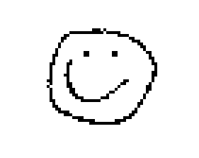

# KCAV
Krazune's Cellular Automata Viewer is a viewer for a collection of 2d cellular automata, in which images are used as input.

## Version
Current version: **2021.12.1**

The version format is "*\<year\>.\<zero padded month\>.\<revision number\>*".

## Cellular Automata

### Game of Life


**KCAV identifier:** *life*

**Neighborhood type:** Moore neighborhood

#### Rules

[Rules available at wikipedia.](https://en.wikipedia.org/wiki/Conway%27s_Game_of_Life)

#### KCAV's Image Conversion

Black and white pixels are kept as is. Other colors are converted into the closest valid color.

#### Notes

One of the most popular cellular automata.

---

### Seeds



**KCAV identifier:** *seeds*

**Neighborhood type:** Moore neighborhood

#### Rules

[Rules available at wikipedia.](https://en.wikipedia.org/wiki/Seeds_(cellular_automaton))

#### KCAV's Image Conversion

Black and white pixels are kept as is. Other colors are converted into the closest valid color.

---

### Brian's Brain


**KCAV identifier:** *brians-brain*

**Neighborhood type:** Moore neighborhood

#### Rules

[Rules available at wikipedia.](https://en.wikipedia.org/wiki/Brian%27s_Brain)

#### KCAV's Image Conversion

Black, white and 100% blue pixels are kept as is. Other colors are converted into the closest valid color.

---

### Live Free or Die


**KCAV identifier:** *lfod*

**Neighborhood type:** Moore neighborhood

#### Rules

[Rules available at LifeWiki.](https://conwaylife.com/wiki/OCA:Live_Free_or_Die)

#### KCAV's Image Conversion

Black, and white pixels are kept as is. Other colors are converted into the closest valid color.

---

### Kladiators


**KCAV identifier:** *kladiators*

**Neighborhood type:** Von Neumann neighborhood

#### Rules

Each pixel turns into the color of the neighbor pixel with the highest sum of r, g, and b channels. If multiple pixels have the same sum, priorities follow anti-clockwise direction.

#### KCAV's Image Conversion

No conversion needed.

#### Notes

Created by Krazune.

---

### Pilots


**KCAV identifier:** *pilots*

**Neighborhood type:** 4 immediate neighbors

#### Rules

The following rules are normalized into cellular automata mechanics: red pixels move right, blue pixels move down, green pixels move left, and yellow pixels move up. When multiple colors hit the same cell, that cell turns black. All other cells are white.

#### KCAV's Image Conversion

Colors are converted into the closest valid color.

#### Notes

Created by Krazune.

## Usage
```./kcav --help```

```./kcav --version```

```./kcav <ruleset identifier> <image path> [options]```

### Options

```--time <milseconds per frame>```

```--scale <initial scale of the window, must be above 1>```

```--first-frame-time <milseconds for the first frame>```

## Dependencies
This project uses [Boost](https://www.boost.org/) 1.75, [SFML](https://www.sfml-dev.org/index.php) 2.5.1, and [Google Test](https://github.com/google/googletest) 1.10.x, earlier versions might be compatible.

## License
[MIT License](LICENSE.md)

## Notes
The performance of this program is not good.

This generator was created for entertainment, and educational purposes.
